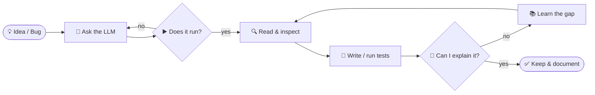

<!-- ============ HEADER ============ -->
<p align="center">
  
</p>

<p align="center">
  <a href="https://aasoft.ir">
    
  </a>
</p>

<p align="center">
  <a href="https://aasoft.ir"></a>
  <a href="mailto:aasoftmohebbi@gmail.com"></a>
  <a href="https://github.com/AASoftIR?tab=repositories"></a>
  
</p>

<p align="center">
  
  
  
  
</p>

---

## 🧑‍💻 `whoami`

```python
class AlirezaMohebbi:
    role      = "Computer Engineering undergrad · Software Developer"
    location  = "Qom, Iran 🇮🇷"
    languages = ["Python", "JavaScript/TypeScript", "PHP", "SQL", "Rust (learning)"]
    interests = ["web apps", "developer tools", "automation", "AI-enabled software", "Linux desktop"]

    def philosophy(self):
        return "AI is one component of the system, not a substitute for engineering fundamentals."

    def current_focus(self):
        return [
            "finish fewer projects, go deeper",
            "write better tests & documentation",
            "ship software I can explain, debug, and maintain",
        ]

    def open_to(self):
        return ["junior roles", "internships / apprenticeships", "freelance", "remote"]
```

> [!TIP]
> **Current focus:** finishing fewer projects, going deeper, writing better tests and documentation, and turning experiments into software I can explain, debug, and maintain.

---

## 🚀 Selected work

| | Project | What it demonstrates | Stack |
|:-:|---|---|---|
| 🧠 | **[AI Exam Generator](https://github.com/AASoftIR/QA-generator)** | Document processing, LLM integration, async workflow, bilingual UI and grading |     |
| ⚡ | **[FlowTransfer](https://github.com/AASoftIR/dl-manager-linux)** 🚧 | Linux-native desktop engineering, download & media workflows *(in development)* |     |
| 📜 | **[Persian Poetry](https://github.com/AASoftIR/persian-poetry-nextjs)** | Small deployed Persian web product (RTL, typography, content) |   |
| 🪐 | **[3D Portfolio Experiment](https://github.com/AASoftIR/portfolio-3d)** | WebGL / 3D interaction |   |

<p align="center">
  <a href="https://github.com/AASoftIR/QA-generator"></a>
  <a href="https://github.com/AASoftIR/dl-manager-linux"></a>
  <a href="https://github.com/AASoftIR/persian-poetry-nextjs"></a>
  <a href="https://github.com/AASoftIR/portfolio-3d"></a>
</p>

---

## 🤖 AI in my engineering workflow

I use LLMs to accelerate **research, architecture exploration, debugging, test generation, code review, and documentation**. I don't treat generated code as automatically correct. Here's the loop every AI suggestion has to survive before it gets merged:



> My goal is to become a stronger engineer **with AI in the loop**, not an engineer who depends on AI to hide gaps in understanding.

---

## 🛠️ Core toolkit

<p align="center">
  <br/>
  <br/>
  
</p>

<details>
<summary><b>📋 Full list (click to expand)</b></summary>

| Area | Tools |
|---|---|
| **Languages** | Python · JavaScript/TypeScript · PHP · SQL · HTML/CSS · Rust *(learning)* |
| **Web** | Flask/Django · Node.js/Express · React/Next.js · Laravel · REST APIs · Tailwind CSS |
| **Data** | SQLite · MySQL · PostgreSQL |
| **AI & automation** | LLM API integration · OpenAI-compatible APIs · RAG fundamentals · n8n · structured outputs |
| **Desktop** | GTK4 / libadwaita · yt-dlp · FFmpeg |
| **Engineering** | Git/GitHub · Linux · testing/debugging · GitHub Actions |

</details>

---

## 📊 GitHub at a glance

<p align="center">
  
  
</p>

<p align="center">
  
</p>

<p align="center">
  
</p>

<p align="center">
  
</p>

<!-- Snake: generated by .github/workflows/snake.yml -->
<p align="center">
  <picture>
    <source media="(prefers-color-scheme: dark)" srcset="https://raw.githubusercontent.com/AASoftIR/AASoftIR/output/github-snake-dark.svg"/>
    
  </picture>
</p>

---

## 🎓 Learning & certificates

<p>
  
  
  
  
  
</p>

📁 Full archive: **[AASoftIR/certificates](https://github.com/AASoftIR/certificates)**

---

## 🧭 Roadmap

- [x] Ship a real LLM-powered product end to end (AI Exam Generator)
- [x] Deploy a Persian-first web product
- [ ] Release **FlowTransfer v1.0** on Linux 🐧
- [ ] Reach solid test coverage on my main projects
- [ ] Write technical posts about what I build and break
- [ ] Contribute to an open-source Linux / dev-tools project

---

## ⚡ Fun facts

```yaml
editor_theme:   dark, always
os:             Linux (obviously)
favorite_bug:   the one that only happens in production
coffee_or_tea:  چای ☕
motto:          "If I can't explain it, I don't ship it."
```

<p align="center">
  
</p>

---

## 📬 Let's connect

<p align="center">
  <a href="https://aasoft.ir"></a>
  <a href="https://github.com/AASoftIR"></a>
  <a href="mailto:aasoftmohebbi@gmail.com"></a>
</p>

<p align="center">
  📍 <b>Qom, Iran</b> · open to <b>junior</b>, <b>internship/apprenticeship</b>, <b>freelance</b>, and <b>remote</b> software opportunities
</p>

<details>
<summary>🇮🇷 <b>فارسی</b></summary>
<br/>
<div dir="rtl" align="right">

### سلام، من علیرضا محبی هستم 👋

دانشجوی مهندسی کامپیوتر و توسعه‌دهنده نرم‌افزار هستم. تمرکزم روی **توسعه وب**، **ابزارهای لینوکسی**، **اتوماسیون** و ساخت نرم‌افزارهایی است که از **هوش مصنوعی به‌عنوان یک ابزار مهندسی** استفاده می‌کنند.

هدف فعلی من تمام‌کردن پروژه‌های کمتر اما عمیق‌تر، نوشتن تست و مستندات بهتر و رسیدن به سطحی است که بتوانم کد و تصمیم‌های فنی پروژه‌هایم را دقیق توضیح بدهم و دیباگ کنم.

📍 قم، ایران · آماده همکاری به‌صورت کارآموزی، جونیور، فریلنس و دورکاری

</div>
</details>

<p align="center">
  
</p>
